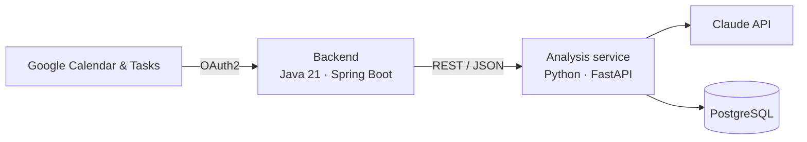

# Jarvis — Plan My Day

An AI-assisted day planner that learns from your Google Calendar. Jarvis analyses how you actually spend your time — when you work, which hours are usually free, how long your recurring activities really take — and uses the Claude API to understand what your events and tasks are about. The goal is a daily plan built around your real habits instead of generic assumptions.

> **Status:** in active development. Calendar analysis, LLM classification and task duration estimation work end to end. Automatic day-plan generation is the next milestone.

## What it does

### Calendar analysis

- **Filters noise.** Events that don't really block time are excluded: cancelled or declined events, events marked "show as free", birthdays, working-location markers and all-day events.
- **Availability heatmap.** Builds a 7 × 24 matrix of how busy each weekday hour usually is. Recent events count more (weight halves every 60 days) and confirmed future events count double, so the result reflects the current routine rather than last year's.
- **Working hours.** Detects typical working hours from the longest continuous run of busy hours per weekday, which ignores one-off early calls and late events.
- **Constraints and free time.** Extracts recurring events as fixed constraints and recommends slots that are consistently free within working hours.

### LLM classification (Claude API)

- Tags event titles and Google Tasks against a hierarchical tag taxonomy (`work` → `deep_work`, `meeting`, … / `personal` → `exercise`, `learning`, …). The taxonomy lives in PostgreSQL and can be edited at runtime through the API.
- Works with titles in any language.
- Sends titles in batches, parses the model's JSON defensively and drops any tag the model invents.
- Caches results by normalised title, so each unique title reaches the LLM only once. When the taxonomy changes, stale cache entries are detected and re-classified.

### Task duration estimation

Every task gets an estimated duration, chosen in this order:

1. The user's own history: the same title in the calendar, then events with the same tag
2. The LLM's estimate, if the model is confident
3. A default duration for the tag
4. A global fallback

## Architecture



- **Backend (Spring Boot)** handles Google sign-in, fetches events and tasks with pagination and forwards them to the analysis service.
- **Analysis service (FastAPI)** runs the analysis and classification and stores results in PostgreSQL. The schema is versioned with Alembic migrations.

## Tech stack

| Area | Technologies |
|---|---|
| Backend | Java 21, Spring Boot 3 (Web, Security, OAuth2 Client), RestClient, Gradle |
| Analysis service | Python 3.10+, FastAPI, Pydantic, psycopg 3 with connection pool, Alembic |
| AI | Anthropic Claude API (Claude Haiku 4.5 by default) |
| Data | PostgreSQL (JSONB with GIN indexes) |
| Testing | pytest, JUnit 5 |

## API

**Backend** — `http://localhost:8080`, requires Google sign-in

| Endpoint | Description |
|---|---|
| `GET /calendar/today` | Today's events |
| `GET /tasks` | Tasks from the "To Do List" task list |
| `GET /api/patterns/analyze?days=30` | Analyse the last N days of the calendar |
| `GET /api/tasks/classify` | Classify tasks and estimate their duration |

**Analysis service** — `http://localhost:8000`, interactive docs at `/docs`

| Endpoint | Description |
|---|---|
| `POST /analyze` | Calendar analysis plus classification of event titles |
| `POST /classify/events` | Classify event titles |
| `POST /classify/tasks` | Classify tasks and estimate duration |
| `GET /tags`, `POST /tags`, `DELETE /tags/{name}` | Manage the tag taxonomy |
| `POST /tags/invalidate-cache` | Re-classify after the taxonomy changes |
| `GET /health` | Health check |

## Getting started

### Prerequisites

- Java 21, Python 3.10+, PostgreSQL
- A Google Cloud project with the **Google Calendar API** and **Google Tasks API** enabled, and an OAuth client with the redirect URI `http://localhost:8080/login/oauth2/code/google`
- An Anthropic API key

### 1. Database

Run PostgreSQL on `localhost:5432`. The defaults are database `postgres`, user `postgres`, password `postgres`; override them with `DB_HOST`, `DB_PORT`, `DB_NAME`, `DB_USER` and `DB_PASSWORD`.

### 2. Analysis service

```bash
cd python_service/Jarvis_test
python -m venv .venv
source .venv/bin/activate
pip install -r requirements.txt
echo "ANTHROPIC_API_KEY=your-key" > .env
alembic upgrade head
python main.py
```

### 3. Backend

```bash
export GOOGLE_CLIENT_ID=your-client-id
export GOOGLE_CLIENT_SECRET=your-client-secret
./gradlew bootRun
```

Open `http://localhost:8080` and sign in with Google. Tasks are read from a Google Tasks list named **To Do List**.

### Tests

```bash
cd python_service/Jarvis_test
pip install pytest
pytest
```

## Roadmap

- [ ] Generate the daily plan: place tasks into free slots using their estimated durations
- [ ] Multi-user support: persist users and Google tokens
- [ ] Onboarding for personal settings: working hours, sleep time, maximum tasks per day
- [ ] Pattern consistency boost: give extra weight to events that repeat at the same time for many weeks
